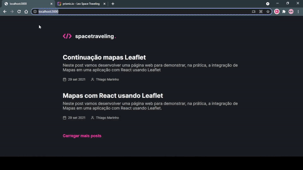

# Blog Space Traveling


<!-- Alterar cover quando o projeto estiver 100% funcional -->


> Website de leitura de notícias

O space traveling é um blog feito do zero usando Next.js e Prismic CMS. Ele é o desafio principal do capítulo III da trilha de React.js do curso Ignite, da Rocketseat. Seu design pode ser encontrado [aqui](https://www.figma.com/file/6lOST9XhVxBPbF0gpyclqR/Desafios-Módulo-3-ReactJS?node-id=0%3A1)

O desafio principal consistiu na criação de um blog do zero seguindo o [layout fornecido](https://www.figma.com/file/6lOST9XhVxBPbF0gpyclqR/Desafios-Módulo-3-ReactJS?node-id=0%3A1). Já o desafio complementar consistiu na implementação de novas features nesse blog.

#### Tarefas principais

- [x] Estilizações global, comun e individuais;
- [x] Importação de fontes Google;
- [x] Paginação de posts;
- [x] Cálculo de tempo estimado de leitura do post;
- [x] Geração de páginas estáticas com os métodos `getStaticProps` e `getStaticPaths`;
- [x] Formatação de datas com `date-fns`;
- [x] Uso de ícones com `react-icons`;
- [x] Requisições HTTP com `fetch`;
- Entre outros.

#### Tarefas complementares

- [x] Comentários com [Utteranc](https://utteranc.es/);
- [x] Preview do documento Prismic;
- [x] Navegação entre post anterior e próximo;
- [x] Informação de edição do post.

## 💻 Tecnologias

Foram usadas, principalmente, duas tecnologias:

- [Next.js](https://nextjs.org/): que permite funções como SSR, SSG e rotas dinâmicas
- [Prismic](https://prismic.io/): um CMS voltado para criação de conteúdo, nesse caso, os posts

## 🚀 Instalando o Blog Space Traveling

Para instalar o Blog Space Traveling, siga estas etapas:

```bash
# No seu terminal, clone o projeto
$ git clone https://github.com/LeoUpperThrower4/RJS-Desafio-05.git

# Entre na pasta...
$ cd RJS-Desafio-05

# Instale as dependências
$ yarn
```

```js
// O projeto faz uso de variáveis ambiente, para armazená-las, você deverá criar um arquivo .env na raiz do seu projeto
PRISMIC_API_ENDPOINT = seu_endpoint;
PRISMIC_ACCESS_TOKEN = sua_chave;
```

## ☕ Usando o Blog Space Traveling

Para usar o Blog Space Traveling, siga estas etapas:

```bash
# No seu terminal, inicie o projeto
$ yarn dev
```

## 📫 Contribuindo para Blog Space Traveling

> Sua contribuição é muito bem vinda! 😀

Para contribuir com o Blog Space Traveling, siga estas etapas:

1. Bifurque este repositório.
2. Crie um branch: `git checkout -b <nome_branch>`.
3. Faça suas alterações e confirme-as: `git commit -m '<mensagem_commit>'`
4. Envie para o branch original: `git push origin RJS-Desafio-05 / <local>`
5. Crie a solicitação de pull.

Como alternativa, consulte a documentação do GitHub em [como criar uma solicitação pull](https://help.github.com/en/github/collaborating-with-issues-and-pull-requests/creating-a-pull-request).

## 📝 Licença

Esse projeto está sob licença MIT.
